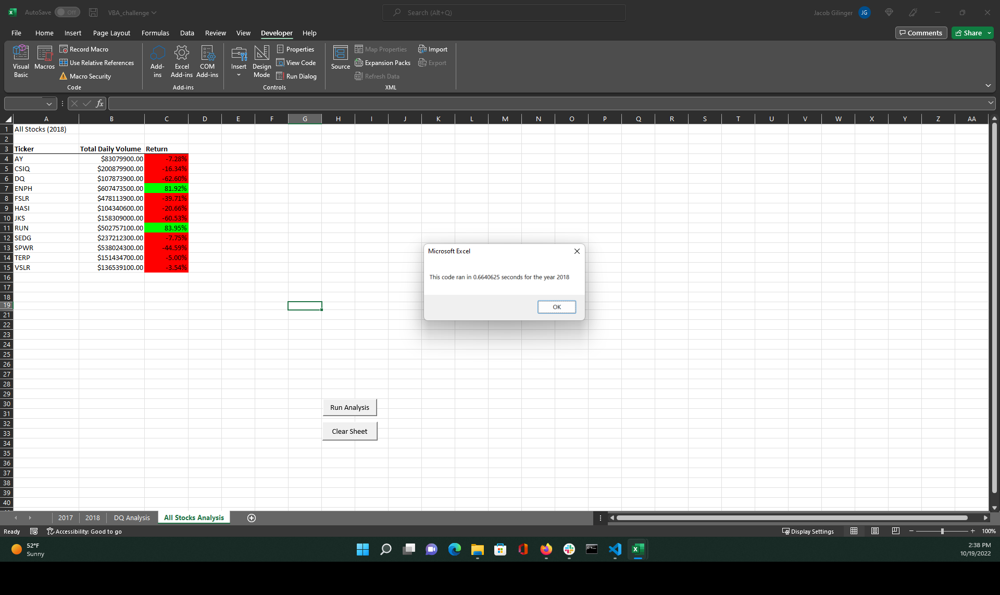
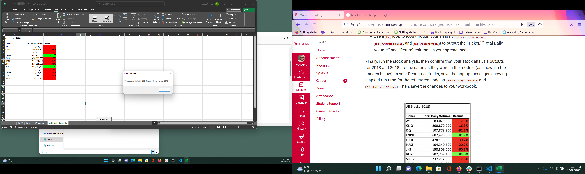

# Stock Analyis for Green Investing

## Overview of Project
    This project deals with stock trading for the years 2017 and 2018 for 12 green energy stocks. Initial information includes the open, high, low, close, adjusted close, and number of trades for each stock during each trading day from this time period. This project specifically looked at DAQO stock and it's investment viability and 11 additional stocks that can expand the diversity of a client portfolio. After creating the initial code for the project we looked at speeding up the VBA code by rewriting it into a single loop rather than a separate loop for each category.

 ### Purpose
         The goal of this projcet is to analyze a selection of 12 green energy stocks. The project looks at their performance during the 2 year period from 2017 through the end of 2018 on a day to day basis. The project looks to average the data set of daily trading information into the more digestible format of Total Daily Volume and Yearly Return percentage for each stock. This will give the client a simpler set of data to evaluate the stock picks for the portfolio. We also looked at establishing a simple code that could be updated in the future to quickly analyze a larger set of daily stock data past the initial 12 Stocks analyzed in this project. 

### Background 
         Steve had asked for an intial analysis of the DAQO stock and the addition of 11 other stocks that maintained the clients green energy commitment. The daily trading information of all stocks was provided. Initial code was written for the DAQO analysis.
         ''' 
         Sub DQAnalysis()
         Worksheets("DQ Analysis").Activate

            Range("A1").Value = "DAQO (Ticker: DQ)"

            'Create a header row
            Cells(3, 1).Value = "Year"
         Cells(3, 2).Value = "Total Daily Volume"
         Cells(3, 3).Value = "Return"
        Worksheets("2018").Activate

            'set initial volume to zero
            totalVolume = 0

            Dim startingPrice As Double
            Dim endingPrice As Double

         'Establish the number of rows to loop over
         rowStart = 2
            rowEnd = Cells(Rows.Count, "A").End(xlUp).Row

         'loop over all the rows
            For i = rowStart To rowEnd

             If Cells(i, 1).Value = "DQ" Then

                 'increase totalVolume by the value in the current row
                 totalVolume = totalVolume + Cells(i, 8).Value

              End If

              If Cells(i - 1, 1).Value <> "DQ" And Cells(i, 1).Value = "DQ" Then

                 startingPrice = Cells(i, 6).Value

              End If

               If Cells(i + 1, 1).Value <> "DQ" And Cells(i, 1).Value = "DQ" Then

                 endingPrice = Cells(i, 6).Value

             End If

         Next i

         Worksheets("DQ Analysis").Activate
          Cells(4, 1).Value = 2018
          Cells(4, 2).Value = totalVolume
          Cells(4, 3).Value = (endingPrice / startingPrice) - 1

        End Sub
        '''
         This code became the basis for creating a more complex code to run through the information for all stocks in a given year and later the simplified reedit that became our final code.

## Results
    Although we were able to create an intial macro for the analyis of all stocks our client wanted to see if it was possible to create one that would run faster. For this the code was refractored to analyze the data using three output arrays
     '''
     '1b) Create three output arrays
    
      Dim tickerVolumes(12) As Long
    
      Dim tickerStartingPrices(12) As Single
    
    Dim tickerEndingPrices(12) As Single
    '''
    These output arrays allow data for each stock to be sent to the correct array in a single loop through the data rather than looping through the data for each ticker.

    With the code from the original macro we have a result, that seems to be more than fast enough for our purposes. 
    
    This is fine until we see that the results of the refactored code comes in over eight times as fast. 
    

## Summary 
    Although both analyses are based off of the same code and have peices like the output that remained largely the same from the original
    '''
      '6) Output data for current ticker
       
           Worksheets("All Stocks Analysis").Activate
       
           Cells(4 + i, 1).Value = ticker
       
          Cells(4 + i, 2).Value = totalVolume
       
          Cells(4 + i, 3).Value = endingPrice / startingPrice - 1
    '''
    to the refactored final
    '''
    '4) Loop through your arrays to output the Ticker, Total Daily Volume, and Return.
    ' Reuses code in Module 1 6 set up as a for loop
    For i = 0 To 11
        
       Worksheets("All Stocks Analysis").Activate
        
       ' Loops through tickers to give the ticker symbol
       Cells(4 + i, 1).Value = tickers(i)
       
       ' Loops through the ticker volumes set up in 3A to give Total Daily Volumefor each
       Cells(4 + i, 2).Value = tickerVolumes(i)
       
       'Loops through Ending Prices and starting prices from 3B and 3C and then outputs the Return percentage
       Cells(4 + i, 3).Value = tickerEndingPrices(i) / tickerStartingPrices(i) - 1
    '''
    We ended up with very different speed results. This has no effect on the results we will give the client as both output the same information it will influence how we addressed expanding the analysis to include a larger number of stocks.

### Advantages
        The immediate advantage of the refactored macro is the higher speed. This is more relavant if we were altering the analyis to add additional stocks and could become very important when we are looking at 100s rather than a dozen. 

### Disadvantages
        Although it is a somewhat marginal issue the refactored code will take more editing to update for additional stocks. The original code only requires adding additional tickers, updating the number of elements in the array, and making sure the for loop for the tickers reflects that number. For the refactored code we have multiple for loops and arrays to update which creates more room for human error. 